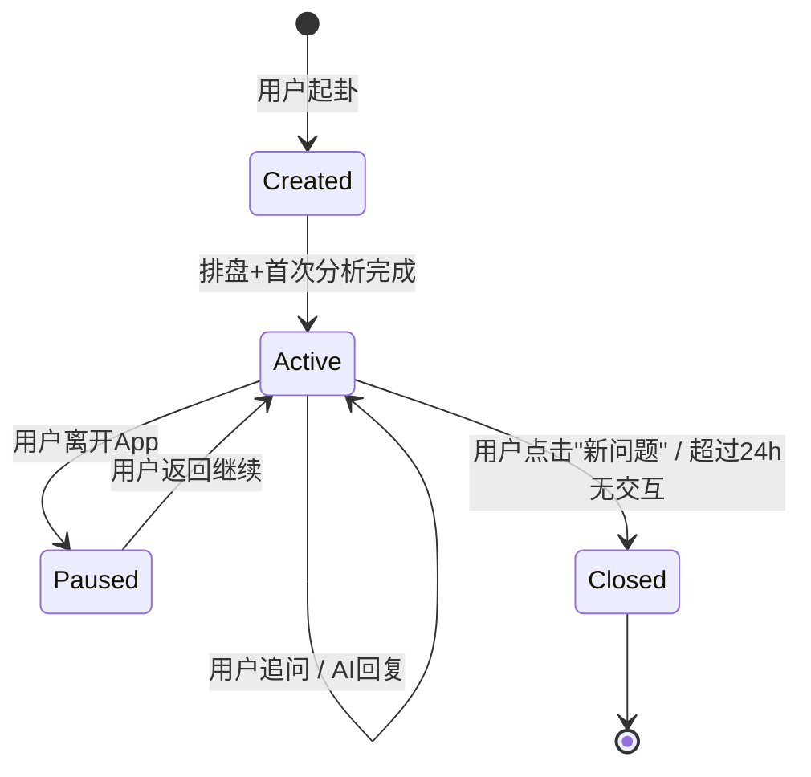

# 产品需求文档 (PRD)：六爻AI断卦系统 v2.0

> **文档版本**：2.0  
> **最后更新**：2026-04-12  
> **状态**：Draft

---

## 一、产品愿景与业务目标

### 1.1 业务痛点

当前系统是一个"单次排盘 → 规则分析 → LLM润色 → 输出结果"的**单次交互工具**。用户提交六爻数据后获得一份静态分析报告，看完即走。核心问题：

| 痛点 | 表现 | 影响 |
|------|------|------|
| 零对话 | 用户无法追问，只能重新起卦 | 次日留存极低 |
| 冷分析 | 输出文本偏机械、术语堆砌 | 用户"看不懂"即流失 |
| 无闭环 | 没有应验追踪和反馈收集 | 无法度量AI准确率、无法形成数据飞轮 |
| 单Agent | LLM仅做文字润色，不具备多维度分析能力 | 解析深度不足，容易出现幻觉 |

### 1.2 重构目标

将系统从"**自动化排盘工具**"升级为"**深度思考辅助与情绪陪伴平台**"。

### 1.3 核心指标 (North Star Metrics)

| 指标 | 当前值(估) | 目标值 | 衡量方式 |
|------|-----------|--------|----------|
| 单次会话平均对话轮数 | 1.0 | ≥3.5 | 后端Session日志 |
| D7留存率 | ~10% | ≥25% | 用户表 + 登录日志 |
| D30留存率 | ~3% | ≥12% | 同上 |
| 应验反馈填写率 | 0% | ≥15% | 反馈表统计 |
| AI解析满意度 | 未衡量 | ≥4.0/5.0 | 每次对话结束打分 |

---

## 二、用户画像

| 画像 | 描述 | 核心诉求 |
|------|------|----------|
| **小白求测者** | 不懂六爻术语，因生活困惑来占卜 | 听得懂的白话解释 + 情绪安抚 + 可操作建议 |
| **初学爱好者** | 有基础六爻知识，想验证自己的判断 | 专业的推演过程 + 古籍引用佐证 |
| **进阶研习者** | 深入学习六爻，希望系统辅助研判 | 精确的规则命中详情 + 知识库深度检索 |

---

## 三、核心功能模块

### 模块一：智能体编排式解析引擎 (Orchestrated Analysis)

#### 3.1.1 需求概述

用一个**编排式Prompt**模拟多智能体协同，在单次LLM调用中整合三个视角的深度解析，替代当前的"机械文本拼接 → LLM简单润色"的浅层管道。

#### 3.1.2 用户故事

- **US-101**：作为小白用户，我希望看到的分析结果不仅有专业的卦象分析，还能用我听得懂的话告诉我该怎么做，让我觉得被理解。
- **US-102**：作为初学爱好者，我希望AI的每一个判断都能引用古籍原文作为依据，让我知道这不是凭空编造的。
- **US-103**：作为任何用户，当AI分析结果不佳时，我不想看到"你完了"这种绝望的话，我期望系统告诉我可以做什么来改善。

#### 3.1.3 功能规格

**输入**：

| 字段 | 来源 | 说明 |
|------|------|------|
| `chartSnapshot` (JSON) | `ChartBuilderService` 排盘引擎 | 完整排盘数据：本变卦、六亲、世应、空亡等 |
| `ruleHits` (JSON Array) | `RuleEngineService` 规则引擎 | 全部命中规则及其证据链和评分 |
| `structuredResult` (JSON) | `RuleReasoningService` | 冲突裁剪后的有效评分、标签、结论 |
| `knowledgeSnippets` (String Array) | `KnowledgeSearchService` RAG | 语义+标签检索的古籍片段（≤6条） |
| `question` (String) | 用户输入 | 用户提問原文 |
| `questionCategory` (String) | 用户选择/AI识别 | 事业/感情/健康/财运等 |

**处理逻辑 — 编排式Prompt结构**：

```
┌───────────────────────────────────────────────────────────────┐
│  System Prompt                                                │
│  ┌─────────────────┐  ┌─────────────────┐  ┌───────────────┐ │
│  │  视角A: 易理推演  │  │  视角B: 古籍佐证  │  │  视角C: 整合输出│ │
│  │  - 分析规则命中  │  │  - 引用知识片段  │  │  - 情感共鸣    │ │
│  │  - 解释五行关系  │  │  - 标注出处      │  │  - 白话翻译    │ │
│  │  - 评估用神强弱  │  │  - 拒识未找到的  │  │  - 行动建议    │ │
│  └─────────────────┘  └─────────────────┘  └───────────────┘ │
└───────────────────────────────────────────────────────────────┘
```

**输出 — 强制JSON Schema**：

```json
{
  "analysis": {
    "hexagramOverview": "string — 卦象概览（本变卦、卦宫、世应位置的白话描述）",
    "useGodAnalysis": "string — 用神分析（状态、受日月影响、强弱判断）",
    "detailedReasoning": "string — 详细推演（关键规则的逐条解读）",
    "classicReferences": [
      {
        "source": "string — 出处，如《增删卜易·用神章》",
        "quote": "string — 原文节选",
        "relevance": "string — 与本卦的关联说明"
      }
    ],
    "conclusion": "string — 综合结论",
    "actionPlan": [
      "string — 具体可操作的建议条目"
    ],
    "predictedTimeline": "string | null — AI推断的应期（如有）",
    "emotionalTone": "CALM | ENCOURAGING | CAUTIOUS — AI检测到的用户情绪分类"
  },
  "metadata": {
    "confidence": 0.0-1.0,
    "modelUsed": "string",
    "ragSourceCount": 0,
    "processingTimeMs": 0
  },
  "smartPrompts": [
    "string — 推荐追问1",
    "string — 推荐追问2",
    "string — 推荐追问3"
  ]
}
```

#### 3.1.4 业务规则

| 规则编号 | 规则内容 |
|---------|---------|
| BR-101 | LLM**绝对不能**修改规则引擎的评分和结论等级，只负责解释和表达 |
| BR-102 | 若RAG未检索到相关古籍（`ragSourceCount == 0`），`classicReferences`必须为空数组，严禁编造 |
| BR-103 | 输出中**绝对不能**包含极端宿命论断语（如"必死"、"绝对破产"） |
| BR-104 | 若结论为负面（`effectiveResultLevel` ∈ {POOR, VERY_POOR}），`actionPlan`**必须**包含≥2条改善建议 |
| BR-105 | 若用户问题极其模糊（<5字且无明确类别），系统应返回澄清引导而非直接分析 |
| BR-106 | `confidence`字段由LLM自评，供后续数据分析使用，不直接展示给用户 |
| BR-107 | `smartPrompts`必须基于当前分析内容动态生成，不使用固定模板 |

#### 3.1.5 降级策略

| 故障场景 | 降级方案 |
|---------|---------|
| LLM API超时（>8s） | 返回 `AnalysisSectionComposer` 的机械文本 + 提示"AI正在思考中，暂时为您展示基础分析" |
| LLM返回非法JSON | 尝试JSON修复1次，失败则降级为机械文本 |
| LLM API Key无效/额度耗尽 | 使用机械文本 + 管理员告警 |
| RAG向量检索异常 | `knowledgeSnippets`传空数组，LLM仍正常执行（无古籍引用段） |
| 规则引擎抛异常 | 返回排盘数据 + "规则分析暂时不可用" |

#### 3.1.6 验收标准

- [x] AC-101：系统输出JSON必须通过Schema校验，无额外字段
- [x] AC-102：对同一卦象连续调用3次，核心结论（conclusion）方向一致性 ≥ 90%
- [x] AC-103：当RAG返回0条时，classicReferences 为空数组
- [x] AC-104：负面结论时 actionPlan 长度 ≥ 2
- [x] AC-105：端到端响应时间（排盘+规则+RAG+LLM）P95 < 12秒
- [x] AC-106：后台日志记录完整的Prompt输入和LLM输出，可追溯

---

### 模块二：多轮情境感知交互 (Session-based Chat)

#### 3.2.1 需求概述

将产品从"一问一答"升级为"持续对话"。用户起卦后进入对话模式，可以围绕同一卦象反复追问，系统保持上下文记忆。

#### 3.2.2 用户故事

- **US-201**：作为求测者，当AI告诉我"财爻受克"时我听不懂，我希望能直接追问"这对我下个月的加薪有影响吗？"，系统要记住我的卦。
- **US-202**：作为用户，我希望关闭App后重新打开，之前的对话和卦象还在，我能继续追问。
- **US-203**：作为小白用户，AI回复后我不知道该问什么，我希望底部有推荐的追问按钮帮我引导。

#### 3.2.3 功能规格

**Session生命周期**：



**Session数据模型**：

```
Session
├── sessionId: UUID
├── userId: Long (nullable, 匿名用户)
├── createdAt: Timestamp
├── lastActiveAt: Timestamp
├── status: ACTIVE | PAUSED | CLOSED
├── chartSnapshotId: Long (FK → case_chart_snapshot)
├── questionCategory: String
├── originalQuestion: String
│
├── Messages[] (时间序列)
│   ├── messageId: UUID
│   ├── role: USER | ASSISTANT | SYSTEM
│   ├── content: Text
│   ├── structuredPayload: JSON (nullable, 仅ASSISTANT消息)
│   ├── createdAt: Timestamp
│   └── tokenCount: Integer (用于Token预算管理)
│
└── contextWindow (运行时构建，不持久化)
    ├── systemPrompt: 固定Prompt模板
    ├── chartContext: 排盘JSON (锁存，始终置于上下文头部)
    ├── ruleContext: 规则命中摘要 (锁存)
    ├── recentMessages: 最近N轮对话 (滑动窗口)
    └── knowledgeContext: 本轮RAG检索结果
```

**Token 预算管理策略**：

| 区域 | 预算上限 | 裁剪策略 |
|------|---------|---------|
| System Prompt | ~800 tokens | 固定，不裁剪 |
| 排盘JSON（锁存） | ~1500 tokens | 固定，不裁剪。首次入上下文时做字段精简（去除ext） |
| 规则摘要（锁存） | ~500 tokens | 只保留有效规则的 ruleCode + hitReason + impactLevel |
| 对话历史 | ~4000 tokens | 滑动窗口：保留最近5轮完整对话。第6轮起，旧轮用摘要替代原文 |
| RAG知识片段 | ~1000 tokens | 每轮追问重新检索，只保留本轮结果 |
| 模型输出预留 | ~1200 tokens | 保证输出空间 |
| **总计** | **~9000 tokens** | 兼容 8K context 模型 |

**追问时的请求处理流程**：

```
用户追问 → 追问文本 + sessionId
    │
    ├── 1. 从DB加载Session + 排盘锁存数据 + 对话历史
    ├── 2. 判断是否需要重新RAG检索（根据追问内容跟前次检索差异度）
    ├── 3. 构建contextWindow（System Prompt + 锁存数据 + 裁剪后历史 + 本轮RAG）
    ├── 4. 调用LLM（编排式Prompt + 追问上下文）
    ├── 5. 解析LLM响应，存入Messages
    └── 6. 返回响应 + 新的smartPrompts
```

#### 3.2.4 业务规则

| 规则编号 | 规则内容 |
|---------|---------|
| BR-201 | 同一Session内，排盘数据不可变更。用户想换卦必须开新Session |
| BR-202 | Session超过24小时无交互自动关闭。关闭后的Session只读，不可追问 |
| BR-203 | 单Session最多保留50条消息（USER+ASSISTANT合计），超出后最早的消息只保留摘要 |
| BR-204 | 匿名用户（未登录）的Session保留7天；登录用户永久保留 |
| BR-205 | 每轮AI回复末尾必须附带3条SmartPrompt追问建议 |

#### 3.2.5 API 契约

**起卦并开启Session**（重构现有 `/api/divinations/analyze`）：

```
POST /api/sessions
Request:
{
  "questionText": "string",
  "questionCategory": "string",
  "divinationTime": "2026-04-12T14:00:00",
  "rawLines": ["老阳","少阴","少阳","老阴","少阳","少阴"],
  "movingLines": [1, 4]
}

Response:
{
  "sessionId": "uuid",
  "chartSnapshot": { ... },
  "analysis": { ... },          // 首次分析结果（同模块一输出Schema）
  "smartPrompts": ["...", "...", "..."]
}
```

**Session内追问**：

```
POST /api/sessions/{sessionId}/messages
Request:
{
  "content": "这个空亡对我的财运具体影响是什么？"
}

Response:
{
  "messageId": "uuid",
  "analysis": { ... },          // 追问的分析结果
  "smartPrompts": ["...", "...", "..."]
}
```

**获取Session历史**：

```
GET /api/sessions/{sessionId}

Response:
{
  "sessionId": "uuid",
  "status": "ACTIVE",
  "chartSnapshot": { ... },
  "messages": [
    { "messageId": "...", "role": "USER", "content": "...", "createdAt": "..." },
    { "messageId": "...", "role": "ASSISTANT", "content": "...", "structuredPayload": {...}, "createdAt": "..." }
  ]
}
```

**获取用户的Session列表**：

```
GET /api/sessions?userId={userId}&status=ACTIVE&page=0&size=20

Response:
{
  "items": [
    {
      "sessionId": "uuid",
      "originalQuestion": "...",
      "questionCategory": "...",
      "messageCount": 8,
      "lastActiveAt": "...",
      "status": "ACTIVE"
    }
  ],
  "totalCount": 15
}
```

#### 3.2.6 验收标准

- [x] AC-201：用户连续追问10轮，AI的回复仍正确引用本卦和变卦名称
- [x] AC-202：关闭App后重新打开，History页面可见所有历史Session，点击可继续对话
- [x] AC-203：超过24h未交互的Session自动变为CLOSED状态，追问API返回409
- [x] AC-204：SmartPrompt追问建议与当前对话内容相关，而非固定模板

---

### 模块三：应验日历与反馈闭环 (Verification Calendar)

#### 3.3.1 需求概述

当AI在分析中推断出"应期"（预测事件发生的关键时间节点）时，系统自动创建应用内日历提醒。到达该时间点后推送通知，询问用户实际结果，形成数据闭环。

#### 3.3.2 用户故事

- **US-301**：作为用户，当AI说"下个月中旬财运可能好转"时，我希望系统自动帮我设置一个提醒，到时候问我是不是真的好转了。
- **US-302**：作为用户，我希望有一个时间线视图，能看到我过去的所有占卜和它们的应验结果。
- **US-303**：作为产品运营，我需要收集用户的应验反馈数据，用于评估和优化AI的预测准确率。

#### 3.3.3 功能规格

**应验事件数据模型**：

```
VerificationEvent
├── eventId: UUID
├── sessionId: UUID (FK → session)
├── userId: Long
├── predictedDate: Date (AI推断的应期)
├── predictedDatePrecision: DAY | WEEK | MONTH (精度)
├── predictionSummary: String (AI预测内容摘要)
├── questionCategory: String
├── status: PENDING | REMINDED | FEEDBACK_RECEIVED | EXPIRED
├── reminderSentAt: Timestamp (nullable)
│
├── Feedback (nullable)
│   ├── accuracy: ACCURATE | PARTIALLY_ACCURATE | INACCURATE | UNSURE
│   ├── actualOutcome: String (用户描述实际结果，限200字)
│   ├── tags: String[] (预设标签选择：如 "比预期好"/"比预期差"/"时间准确"/"方向偏了")
│   └── submittedAt: Timestamp
│
├── createdAt: Timestamp
└── updatedAt: Timestamp
```

**应验日历流程**：

```
AI分析输出含predictedTimeline
    │
    ├── 1. 解析应期文本 → 转为日期（模糊日期取中间值）
    ├── 2. 创建 VerificationEvent (status=PENDING)
    ├── 3. 前端日历视图展示事件卡片
    │
    ├── [到达预测日期前1天]
    │   └── 4. 应用内推送通知："您之前占卜的XX事件的预测时间快到了"
    │
    ├── [到达预测日期]
    │   └── 5. 推送反馈邀请："您占卜的XX事项，实际情况如何？"
    │       └── 用户填写反馈表单（选择题 + 可选文字）
    │
    └── [超过预测日期7天未反馈]
        └── 6. 再推送一次。超14天标记为EXPIRED
```

**日历视图**：

| 视图类型 | 说明 |
|---------|------|
| 月视图 | 在日期格上标注有应验事件的日期（带色点），点击展开事件列表 |
| 时间线视图 | 按时间倒序展示所有占卜Session + 应验事件，类似Timeline |

#### 3.3.4 反馈表单设计（轻量化）

```
┌────────────────────────────────────────┐
│  📅 您4/5占卜的"求职面试"                │
│  AI预测："4月中旬会有积极进展"            │
│                                        │
│  实际结果如何？                          │
│  ○ 很准   ○ 部分准   ○ 不太准   ○ 不确定 │
│                                        │
│  标签（可多选）：                         │
│  [时间准] [方向准] [比预期好] [比预期差]   │
│  [完全没发生] [有变化但不同]              │
│                                        │
│  补充说明（可选）：                       │
│  [                                    ] │
│                                        │
│  [提交反馈]                             │
└────────────────────────────────────────┘
```

#### 3.3.5 API 契约

```
GET /api/calendar/events?userId={userId}&month=2026-04
POST /api/calendar/events/{eventId}/feedback
GET /api/calendar/timeline?userId={userId}&page=0&size=20
```

#### 3.3.6 业务规则

| 规则编号 | 规则内容 |
|---------|---------|
| BR-301 | 只有当AI输出的`predictedTimeline`不为null时才创建应验事件 |
| BR-302 | 模糊日期解析规则："下个月中旬" → 次月15日，精度=WEEK |
| BR-303 | 每个Session最多创建1个应验事件 |
| BR-304 | 反馈表单必须以选择题为主，文字输入可选，确保 ≥15% 填写率 |
| BR-305 | 反馈数据仅用于模型评估和优化，不对外展示 |

#### 3.3.7 验收标准

- [x] AC-301：AI输出含应期时，应验事件自动创建
- [x] AC-302：日历视图正确展示本月所有应验事件
- [x] AC-303：反馈提交后，事件状态更新为 FEEDBACK_RECEIVED

---

### 模块四：沉浸式体验增强 (Experience Enhancement)

#### 3.4.1 TTS 语音陪伴（P2）

- 接入TTS API（如 OpenAI TTS / 阿里云语音），将AI回复文本转为语音
- 提供2种声线：**知性导师**（清朗中性）、**温和长者**（低沉温暖）
- 前端播放控件：播放/暂停、语速调节（0.75x~1.5x）
- 支持后台播放
- **首字响应时长 < 1.5秒**（采用流式TTS）

#### 3.4.2 起卦仪式感动效（P2）

- 起卦等待阶段：铜钱翻转微动效 + 呼吸光晕
- 结果展示阶段：卦象卡片入场动画（从墨迹中浮现）
- 消息气泡：AI回复逐字打字机效果

#### 3.4.3 新中式视觉体系

- **色彩体系**：橄榄绿 `#5B7553` / 奶油色 `#F5F0E8` / 深森林色 `#2D3B2D` / 点缀金 `#C9A96E`
- **暗黑模式**：手动切换（MVP），后续可探索按时辰自动切换
- **字体**：中文用思源宋体/霞鹜文楷，西文用 Inter
- **圆角**：大圆角(16px) 卡片，营造柔和氛围

---

## 四、数据库Schema变更概览

### 新增表

| 表名 | 用途 |
|------|------|
| `chat_session` | 对话会话 |
| `chat_message` | 会话消息 |
| `verification_event` | 应验事件 |
| `verification_feedback` | 应验反馈 |

### 现有表变更

| 表名 | 变更 |
|------|------|
| `divination_case` | 新增 `session_id` 外键 |
| `case_analysis_result` | 新增 `structured_payload_json` 字段 |

---

## 五、分阶段交付计划

### Phase 1：对话核心（4周）

> 目标：从单次交互变为多轮对话，系统形态根本性转变

| 周次 | 交付内容 |
|------|---------|
| W1 | Session数据模型 + DB Migration + Session CRUD API |
| W2 | 编排式Prompt重构 `LlmExpressionClient` → `OrchestratedAnalysisService` |
| W3 | 多轮追问API + Token预算管理 + SmartPrompt动态生成 |
| W4 | 前端对话UI改造（聊天界面 + Session列表 + 历史回看） |

### Phase 2：应验闭环（3周）

> 目标：建立用户反馈的数据飞轮

| 周次 | 交付内容 |
|------|---------|
| W5 | 应验事件数据模型 + 应期解析 + 自动创建 |
| W6 | 日历/时间线视图 + 反馈表单 |
| W7 | 推送通知 + 反馈数据统计Dashboard（内部） |

### Phase 3：体验打磨（2周）

> 目标：视觉和体验升级

| 周次 | 交付内容 |
|------|---------|
| W8 | 新中式设计体系全量落地 + 暗黑模式 |
| W9 | 起卦动效 + 打字机效果 + TTS集成 |

---

## 六、非功能需求

| 维度 | 要求 |
|------|------|
| 性能 | 首次分析 P95 < 12s；追问 P95 < 8s |
| 可用性 | LLM不可用时100%降级为机械文本，不白屏 |
| 安全 | 用户对话数据加密存储；API Key不硬编码、存环境变量 |
| 可观测性 | 每次LLM调用记录完整Prompt/Response、耗时、Token用量 |
| 数据合规 | 用户可删除自己的所有数据（GDPR对标） |

---

## 七、风险与缓解

| 风险 | 概率 | 影响 | 缓解措施 |
|------|------|------|---------|
| LLM输出不遵守JSON Schema | 中 | 前端渲染异常 | 强制 `response_format: json_object` + 响应校验 + 重试 |
| 多轮对话Token溢出 | 高 | AI丢失上下文 | 严格Token预算 + 滑动窗口 + 摘要压缩 |
| 用户应验反馈填写率低 | 高 | 数据飞轮无法启动 | 轻量化表单（选择题为主）+ 推送提醒2次 |
| LLM API成本超预期 | 中 | 运营亏损 | 监控Token用量 + 必要时切换更小模型做追问 |
