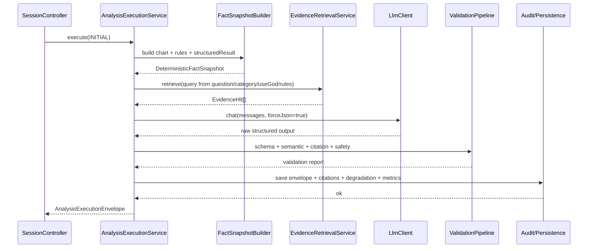

# 六爻AI断卦系统平台级重构架构设计文档

> **文档版本**：1.0  
> **最后更新**：2026-04-13  
> **状态**：Proposed  
> **前置文档**：[六爻AI断卦系统平台级整改需求文档](./六爻AI断卦系统平台级整改需求文档.md) · [产品需求文档](./六爻AI断卦系统产品需求文档.md) · [技术设计文档](./六爻AI断卦系统设计文档.md)

---

## 一、设计目标

本设计文档用于定义“平台级重构”后的目标架构、模块边界、核心数据契约、持久化模型与迁移策略。

本次设计坚持以下原则：

1. **平台优先，不等于立即拆微服务**  
   第一阶段采用“模块化单体 + 提取边界清晰”的方式落地，避免为平台化而引入不必要的分布式复杂度。
2. **确定性事实优先于 LLM 表达**  
   规则引擎、排盘与结构化结果仍然是系统事实层；LLM 只负责解释、整合和用户沟通。
3. **证据一等公民**  
   RAG 命中、最终引用、前端展示、评估与审计必须共享同一证据对象模型。
4. **降级可见，失败可分型**  
   平台不能只“默默回退”；必须告诉上游“发生了什么、回退到了哪里”。
5. **评估贯穿开发与运行**  
   平台设计必须天然支持 Prompt regression、replay、RAG 评估、线上反馈回灌。

---

## 二、当前基线与重构方向

### 2.1 当前基线

当前代码基线可概括为：

- `liuyao-app`
  - `session`：主入口与多轮会话
  - `analysis`：编排式分析 + 旧分析服务并存
  - `rule`：确定性规则推演
  - `knowledge`：检索服务与 chunk 查询
  - `calendar`：应验提醒与反馈
  - `casecenter`：案例留痕与 replay
- `liuyao-worker`
  - 文档解析、chunk、embedding、规则候选抽取
- `liuyao-h5`
  - 起卦、对话、历史、日历页面

当前主问题不是“没有能力”，而是平台能力分散：

- 分析契约分叉
- evidence 仍是字符串
- 输出治理不够严格
- 评估能力没有统一抽象
- 运行时能力偏单机

### 2.2 目标方向

平台级重构后的系统，将以 4 个平台域为主轴：

- **Analysis Runtime Platform**：统一分析执行
- **Evidence Platform**：统一证据检索与引用
- **Evaluation Platform**：统一质量评估与 replay
- **Operations Platform**：统一限流、调度、审计、配置版本

---

## 三、目标架构总览

### 3.1 逻辑架构

```mermaid
flowchart TD
    H5["liuyao-h5"]
    Legacy["Legacy Analyze API"]
    Session["Session API"]

    subgraph APP["liuyao-app"]
        Adapter["Compatibility Adapter Layer"]

        subgraph ARP["Analysis Runtime Platform"]
            Exec["AnalysisExecutionService"]
            Facts["Deterministic Fact Builder"]
            Validate["Analysis Validation Pipeline"]
            Present["Presentation Composer"]
        end

        subgraph EVP["Evidence Platform"]
            Retrieve["EvidenceRetrievalService"]
            Cite["Citation Resolver"]
            Provenance["Evidence Provenance Store"]
        end

        subgraph EGP["Evaluation Platform"]
            Replay["Replay Service"]
            Eval["Evaluation Runner"]
            Dataset["Dataset Registry"]
        end

        subgraph OPP["Operations Platform"]
            Limit["Persistent Rate Limit"]
            Jobs["Lease-based Job Runtime"]
            Audit["Execution Audit / Trace"]
            Config["Version Registry"]
        end

        subgraph Domain["Deterministic Domain"]
            Chart["ChartBuilderService"]
            Rule["RuleEngineService"]
            Case["CaseCenterService"]
            Calendar["VerificationEventService"]
        end

        LLM["LlmClient / Model Gateway"]
    end

    Worker["liuyao-worker"]
    DB[("PostgreSQL + pgvector")]

    H5 --> Session
    H5 --> Legacy
    Session --> Adapter
    Legacy --> Adapter
    Adapter --> Exec

    Exec --> Facts
    Exec --> Retrieve
    Exec --> LLM
    Exec --> Validate
    Exec --> Present
    Exec --> Audit
    Exec --> Config

    Facts --> Chart
    Facts --> Rule
    Exec --> Case
    Exec --> Calendar

    Retrieve --> DB
    Cite --> DB
    Provenance --> DB
    Replay --> DB
    Eval --> DB
    Limit --> DB
    Jobs --> DB
    Audit --> DB
    Config --> DB
    Worker --> DB
```



### 3.2 关键判断

本次不建议在第一阶段将以上平台域拆成物理独立服务。推荐做法是：

- 先在 `liuyao-app` 内完成包结构和契约重构
- 通过统一接口与持久化边界把“未来可拆分的点”做出来
- 当运行量、团队边界或运维诉求真正出现时，再物理拆分

---

## 四、目标模块划分

### 4.1 `analysis.runtime` 平台域

#### 责任

- 统一首次分析、追问分析、legacy 分析、replay 分析的执行入口
- 组装确定性事实、RAG 结果、LLM 调用、验证、降级、展示
- 产出统一 `AnalysisExecutionEnvelope`

#### 推荐包结构

```text
com.yishou.liuyao.analysis.runtime
com.yishou.liuyao.analysis.contract
com.yishou.liuyao.analysis.validation
com.yishou.liuyao.analysis.policy
com.yishou.liuyao.analysis.presentation
```

#### 新核心类

- `AnalysisExecutionService`
- `AnalysisExecutionRequest`
- `AnalysisExecutionEnvelope`
- `DeterministicFactSnapshotBuilder`
- `AnalysisValidationPipeline`
- `DegradationResolver`
- `PresentationCompatibilityAdapter`

### 4.2 `evidence` 平台域

#### 责任

- 承接 query -> retrieval -> ranking -> citation resolution
- 让 evidence 成为标准对象
- 为 analysis、replay、前端展示和评估共享数据模型

#### 推荐包结构

```text
com.yishou.liuyao.evidence
com.yishou.liuyao.evidence.dto
com.yishou.liuyao.evidence.service
com.yishou.liuyao.evidence.repository
com.yishou.liuyao.evidence.validation
```

#### 新核心类

- `EvidenceRetrievalService`
- `EvidenceQuery`
- `EvidenceHit`
- `EvidenceCitation`
- `EvidenceSelectionResult`
- `CitationValidationService`

### 4.3 `evaluation` 平台域

#### 责任

- 统一 replay、prompt regression、RAG 评估、线上反馈评估
- 为不同版本快照产出统一评估报告

#### 推荐包结构

```text
com.yishou.liuyao.evaluation
com.yishou.liuyao.evaluation.dataset
com.yishou.liuyao.evaluation.runner
com.yishou.liuyao.evaluation.report
```

#### 新核心类

- `EvaluationDatasetRegistry`
- `EvaluationRunService`
- `EvaluationScenario`
- `EvaluationScoreCard`
- `ReplayEvaluationAdapter`
- `RagEvaluationAdapter`

### 4.4 `ops.platform` 平台域

#### 责任

- 持久化限流
- 租约化任务调度
- 执行审计与 trace
- 配置版本登记

#### 推荐包结构

```text
com.yishou.liuyao.ops.ratelimit
com.yishou.liuyao.ops.job
com.yishou.liuyao.ops.audit
com.yishou.liuyao.ops.configversion
```

#### 新核心类

- `PersistentRateLimiter`
- `JobLeaseService`
- `ExecutionAuditService`
- `PlatformVersionRegistry`

---

## 五、核心数据契约

### 5.1 统一执行请求

```json
{
  "mode": "INITIAL | FOLLOW_UP | LEGACY_COMPAT | REPLAY",
  "requestMeta": {
    "executionId": "uuid",
    "source": "SESSION_API | LEGACY_API | REPLAY_JOB",
    "userId": 1001,
    "sessionId": "uuid-or-null",
    "caseId": 123
  },
  "question": {
    "originalQuestion": "这次合作推进会不会顺利",
    "followUpQuestion": "那接下来要注意什么",
    "questionCategory": "合作"
  },
  "chartInput": {
    "chartSnapshotId": 123,
    "reuseStoredSnapshot": true
  },
  "runtimeOptions": {
    "enableRag": true,
    "enableLlm": true,
    "forceLegacyText": false
  }
}
```

### 5.2 统一执行结果信封

```json
{
  "executionId": "uuid",
  "mode": "INITIAL",
  "deterministic": {
    "chartSnapshot": {},
    "ruleHits": [],
    "structuredResult": {}
  },
  "retrieval": {
    "query": {},
    "hits": [],
    "selectedCitations": []
  },
  "llm": {
    "requested": true,
    "model": "qwen-plus",
    "rawStructuredOutput": {},
    "validation": {
      "schemaPassed": true,
      "semanticPassed": true,
      "citationPassed": true,
      "safetyPassed": true,
      "issues": []
    }
  },
  "presentation": {
    "analysisOutput": {},
    "legacyText": "string"
  },
  "degradation": {
    "level": "FULL | PARTIAL_WITHOUT_RAG | PARTIAL_WITH_FALLBACK_TEXT | SAFE_REFUSAL",
    "reasons": []
  },
  "versions": {
    "promptVersion": "v1",
    "ruleBundleVersion": "v1",
    "ruleDefinitionsVersion": "v1",
    "useGodRulesVersion": "v1",
    "retrievalVersion": "v2",
    "modelVersion": "qwen-plus"
  },
  "metrics": {
    "totalLatencyMs": 0,
    "ragLatencyMs": 0,
    "llmLatencyMs": 0
  }
}
```

### 5.3 证据对象契约

```json
{
  "chunkId": 10001,
  "bookId": 12,
  "sourceTitle": "增删卜易摘录",
  "chapterTitle": "用神总论",
  "knowledgeType": "rule",
  "focusTopic": "用神",
  "content": "用神宜旺相，不宜休囚。",
  "rank": 1,
  "score": 0.91,
  "retrievalReason": "semantic+topic",
  "metadata": {
    "scenarioTypes": ["合作", "求财"],
    "liuQinFocus": ["妻财", "官鬼"]
  }
}
```

### 5.4 最终引用契约

```json
{
  "citationId": "uuid",
  "chunkId": 10001,
  "source": "《增删卜易·用神总论》",
  "quote": "用神宜旺相，不宜休囚。",
  "relevance": "当前用神受制，因此引用该条解释用神强弱判断。",
  "quoteSpan": {
    "startOffset": 0,
    "endOffset": 12
  }
}
```

---

## 六、执行流设计

### 6.1 首次分析执行流



### 6.2 追问执行流

追问与首次分析共用执行平台，但有两个关键差异：

- `question` 由 `followUpQuestion + originalQuestion + recent context` 共同决定
- evidence query 不能只用问类，必须带入当前追问文本

当前 `safeSearchKnowledgeByQuestion()` 仍然主要按问类和用神检索，平台级重构后必须改为真正使用追问语义。

### 6.3 legacy analyze 执行流

legacy analyze 未来不再直接拼旧文本，而是：

1. 先进入 `AnalysisExecutionService`
2. 产出统一执行信封
3. 通过 `PresentationCompatibilityAdapter` 把结构化输出映射回旧接口字段

这意味着兼容不再等于保留旧实现，而是“保留旧 API，移除旧链路分叉”。

---

## 七、验证与降级设计

### 7.1 验证流水线

推荐按以下顺序执行：

1. `SchemaValidationStage`
2. `SemanticAlignmentStage`
3. `CitationValidationStage`
4. `SafetyPolicyStage`
5. `FollowUpRelevanceStage`

### 7.2 语义验证规则

#### `SemanticAlignmentStage`

校验以下对象是否对齐：

- `useGod`
- `effectiveResultLevel`
- 结论方向
- 问类
- 是否存在虚构的关键卦象信息

#### `CitationValidationStage`

校验以下对象是否对齐：

- `classicReferences[*].source`
- `classicReferences[*].quote`
- `classicReferences[*]` 是否可映射到本次 evidence hits

#### `SafetyPolicyStage`

针对以下问类执行附加规则：

- `健康`
- `官司`
- `财运`
- `房产`

典型策略：

- 必须附加“仅作参考”的引导语
- 禁止绝对化断言
- 必须包含行动建议

### 7.3 降级模型

| 触发条件 | 降级级别 | 行为 |
|---|---|---|
| RAG 检索失败 | `PARTIAL_WITHOUT_RAG` | 继续走 LLM，但不允许引用古籍 |
| LLM 超时/空响应 | `PARTIAL_WITH_FALLBACK_TEXT` | 回退结构化 fallback / 兼容文本 |
| JSON 解析失败 | `PARTIAL_WITH_FALLBACK_TEXT` | 记录失败原因并回退 |
| 语义冲突 | `PARTIAL_WITH_FALLBACK_TEXT` | 丢弃 LLM 结果，改用 fallback |
| 安全策略不满足 | `SAFE_REFUSAL` | 返回安全引导结果 |

---

## 八、持久化模型设计

### 8.1 新增表建议

在现有 `V20` 之后新增平台级表。

#### `analysis_run`

记录一次完整分析执行。

关键字段：

- `id`
- `execution_id`
- `mode`
- `source`
- `session_id`
- `case_id`
- `prompt_version`
- `rule_bundle_version`
- `rule_definitions_version`
- `use_god_rules_version`
- `retrieval_version`
- `model_version`
- `degradation_level`
- `total_latency_ms`
- `rag_latency_ms`
- `llm_latency_ms`
- `payload_json`
- `created_at`

#### `analysis_run_citation`

记录执行与引用之间的映射关系。

关键字段：

- `id`
- `analysis_run_id`
- `chunk_id`
- `book_id`
- `rank`
- `score`
- `source`
- `quote`
- `relevance`
- `selected`

#### `analysis_run_issue`

记录结构化失败与降级原因。

关键字段：

- `id`
- `analysis_run_id`
- `stage`
- `issue_code`
- `severity`
- `message`
- `details_json`

#### `platform_rate_limit_bucket`

替代内存限流计数。

关键字段：

- `principal`
- `bucket_date`
- `used_count`
- `updated_at`

#### `platform_job_lease`

支持多实例调度防重入。

关键字段：

- `job_name`
- `lease_owner`
- `lease_until`
- `heartbeat_at`

#### `evaluation_run`

统一离线评估结果。

关键字段：

- `id`
- `run_type`
- `dataset_name`
- `prompt_version`
- `rule_bundle_version`
- `retrieval_version`
- `model_version`
- `summary_json`
- `created_at`

### 8.2 与现有表关系

- `casecenter` 继续保留产品与 replay 语义
- `analysis_run` 负责平台执行审计
- `case replay` 与 `evaluation_run` 不重复，而是 replay 可以成为 evaluation 的一种输入

---

## 九、知识平台与 worker 协同设计

### 9.1 `liuyao-worker` 继续承担的职责

- 文档解析
- chunk 生成
- embedding
- metadata enrichment
- 规则候选抽取

### 9.2 平台级新增要求

worker 输出必须更稳定地服务 evidence 平台：

- chunk 元数据必须保留稳定来源定位字段
- 检索结果必须能稳定映射到 chunk 主键
- metadata 中应统一包含 `knowledgeType`、`scenarioTypes`、`liuQinFocus`

### 9.3 evidence 查询建议

`KnowledgeSearchService` 未来不再直接返回 `List<String>`，而是：

- `List<EvidenceHit>`
- 对旧调用点提供 `toPromptSnippets()` 适配方法

这样可以兼顾：

- Prompt 组装
- 前端证据展示
- 审计落库
- 评估使用

---

## 十、运行时平台设计

### 10.1 持久化限流

当前 `RateLimiter` 为进程内实现，平台级重构后建议：

- 使用数据库表实现按日 bucket 计数
- 采用原子更新方式保证多实例一致
- 为匿名用户保留 IP / 设备指纹扩展位

### 10.2 租约化调度

当前 `@Scheduled` 可保留，但任务执行必须先尝试获取租约。

流程：

1. 服务启动定时触发
2. 尝试占用 `platform_job_lease`
3. 获得租约的实例执行任务
4. 定期 heartbeat
5. 超时自动释放

适用任务：

- Session 清理
- Verification reminders
- Verification expiration
- 未来 evaluation jobs

### 10.3 审计与 trace

所有调用必须共享：

- `traceId`
- `executionId`
- `sessionId`
- `caseId`
- `userId`

记录对象：

- 请求摘要
- 检索摘要
- 模型摘要
- 校验摘要
- 降级摘要

---

## 十一、迁移策略

### 11.1 Phase A：加法重构

目标：新增平台对象，不切旧入口。

动作：

- 新增 `AnalysisExecutionService`
- 新增 evidence 对象和审计表
- 新增 validation pipeline
- `SessionService` 先接入新平台

### 11.2 Phase B：兼容收口

目标：legacy analyze 改由平台适配输出。

动作：

- `DivinationService` 不再直接依赖旧 `AnalysisService`
- 旧接口只作为兼容外壳
- fallback 文本由 `PresentationCompatibilityAdapter` 统一生成

### 11.3 Phase C：旧链路下线

目标：移除旧 `AnalysisService` 主责任，仅保留必要兼容工具。

动作：

- 标记旧链路 for removal
- 更新文档与测试基线
- replay 与 regression 全量转向平台执行信封

---

## 十二、测试与质量策略

### 12.1 单元测试

覆盖以下核心对象：

- `AnalysisValidationPipeline`
- `CitationValidationService`
- `PersistentRateLimiter`
- `JobLeaseService`

### 12.2 集成测试

覆盖以下主流程：

- 创建 Session 分析
- 追问分析
- legacy analyze 兼容输出
- 无 RAG 降级
- LLM 语义冲突降级

### 12.3 评估测试

统一纳入以下运行：

- Prompt regression
- replay regression
- RAG retrieval evaluation
- safety policy evaluation

### 12.4 CI 建议

按变更范围触发：

- Prompt 改动 -> Prompt regression
- rule / useGod 改动 -> replay + rule regression
- knowledge / worker 改动 -> RAG evaluation + worker tests
- runtime 改动 -> session + integration + ops tests

---

## 十三、实施建议

平台级重构应采用“架构先统一、物理后拆分”的策略。

推荐顺序：

1. 先统一契约与 evidence 对象
2. 再统一 validation、degradation 与审计
3. 再接入持久化限流和租约调度
4. 最后收口 legacy analyze 链路

这样做的好处是：

- 不会中断现有产品能力
- 可以持续获得阶段性收益
- 不会因为过早拆服务而显著放大复杂度

---

## 十四、结论

本次平台级重构的重点，不是让系统“看起来更像平台”，而是把当前已经存在的多轮分析、RAG、replay、反馈、CI 等资产，统一提升到同一条可验证、可审计、可迁移的主链路上。

设计完成后的目标状态应该是：

- 任意分析入口都走同一执行平台
- 任意古籍引用都能找到真实来源对象
- 任意降级都能被结构化识别
- 任意版本变更都能进入统一评估体系

当这四点成立时，系统才真正具备后续继续产品化、平台化、甚至服务拆分的工程基础。
