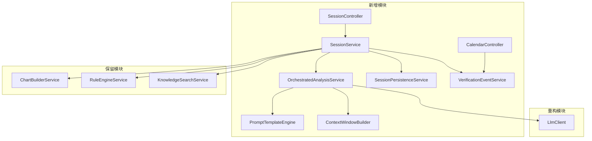

# 六爻AI断卦系统 v2.0 技术设计文档

> **文档版本**：2.0  
> **最后更新**：2026-04-12  
> **前置文档**：[产品需求文档](./六爻AI断卦系统产品需求文档.md)

---

## 一、系统架构总览

### 1.1 现有架构

```
liuyao-h5 (Vite + React + TS)
    │  POST /api/divinations/analyze
    ▼
liuyao-app (Spring Boot + JPA + PostgreSQL)
    ├── DivinationController          ← 唯一入口
    │     └── DivinationService
    │           ├── ChartBuilderService     ← 确定性排盘
    │           ├── RuleEngineService       ← 确定性规则推演
    │           ├── KnowledgeSearchService  ← RAG 古籍检索
    │           └── AnalysisService
    │                 ├── AnalysisSectionComposer  ← 机械文本拼接
    │                 └── LlmExpressionClient      ← 单次LLM润色
    │
liuyao-worker (Python)
    └── 古籍分块 + Embedding Pipeline
```

**核心问题**：单次请求→单次响应，无会话概念；LLM仅做润色，不做深度分析。

### 1.2 目标架构

```
liuyao-h5 (Vite + React + TS)
    │  POST /api/sessions              ← 起卦开Session
    │  POST /api/sessions/{id}/messages ← 多轮追问
    │  GET  /api/sessions/{id}          ← 获取历史
    │  GET  /api/calendar/events        ← 应验日历
    ▼
liuyao-app (Spring Boot + JPA + PostgreSQL)
    │
    ├── SessionController (NEW)
    │     └── SessionService (NEW)
    │           ├── ChartBuilderService           ← 保留，确定性排盘
    │           ├── RuleEngineService              ← 保留，确定性规则
    │           ├── KnowledgeSearchService         ← 增强，混合检索+拒识
    │           ├── OrchestratedAnalysisService    ← NEW，替代 AnalysisService
    │           │     ├── PromptTemplateEngine     ← NEW，模板化Prompt管理
    │           │     ├── LlmClient                ← 重构，支持JSON Schema
    │           │     └── ContextWindowBuilder     ← NEW，Token预算管理
    │           ├── SessionPersistenceService      ← NEW，会话持久化
    │           └── VerificationEventService       ← NEW，应验事件
    │
    ├── CalendarController (NEW)
    │     └── CalendarService (NEW)
    │
    ├── DivinationController                       ← 保留，向后兼容
    │
    └── 定时任务
          ├── SessionCleanupJob                    ← NEW，24h超时关闭
          └── VerificationReminderJob              ← NEW，应验推送
    │
liuyao-worker (Python)
    └── 古籍分块 + Embedding Pipeline              ← 保留
```

### 1.3 模块依赖关系



---

## 二、数据库设计

### 2.1 新增表

#### `chat_session` — 对话会话

```sql
CREATE TABLE chat_session (
    id              UUID PRIMARY KEY DEFAULT gen_random_uuid(),
    user_id         BIGINT,                              -- nullable，匿名用户
    case_id         BIGINT REFERENCES divination_case(id),
    chart_snapshot_id BIGINT REFERENCES case_chart_snapshot(id),
    original_question TEXT NOT NULL,
    question_category VARCHAR(100),
    status          VARCHAR(20) NOT NULL DEFAULT 'ACTIVE', -- ACTIVE / PAUSED / CLOSED
    message_count   INT NOT NULL DEFAULT 0,
    total_tokens    INT NOT NULL DEFAULT 0,                -- 累计Token用量
    created_at      TIMESTAMP NOT NULL DEFAULT CURRENT_TIMESTAMP,
    last_active_at  TIMESTAMP NOT NULL DEFAULT CURRENT_TIMESTAMP,
    closed_at       TIMESTAMP,
    metadata_json   TEXT                                    -- 扩展元数据
);

CREATE INDEX idx_chat_session_user_status ON chat_session(user_id, status);
CREATE INDEX idx_chat_session_last_active ON chat_session(last_active_at) WHERE status = 'ACTIVE';
```

#### `chat_message` — 会话消息

```sql
CREATE TABLE chat_message (
    id              UUID PRIMARY KEY DEFAULT gen_random_uuid(),
    session_id      UUID NOT NULL REFERENCES chat_session(id),
    role            VARCHAR(20) NOT NULL,     -- USER / ASSISTANT / SYSTEM
    content         TEXT NOT NULL,             -- 原始文本内容
    structured_json TEXT,                      -- ASSISTANT消息的结构化JSON输出
    token_count     INT,                       -- 本条消息的token数
    model_used      VARCHAR(100),              -- 使用的模型名
    processing_ms   INT,                       -- 处理耗时
    created_at      TIMESTAMP NOT NULL DEFAULT CURRENT_TIMESTAMP
);

CREATE INDEX idx_chat_message_session ON chat_message(session_id, created_at);
```

#### `verification_event` — 应验事件

```sql
CREATE TABLE verification_event (
    id                  UUID PRIMARY KEY DEFAULT gen_random_uuid(),
    session_id          UUID NOT NULL REFERENCES chat_session(id),
    user_id             BIGINT,
    predicted_date      DATE NOT NULL,
    predicted_precision VARCHAR(20) NOT NULL DEFAULT 'MONTH', -- DAY / WEEK / MONTH
    prediction_summary  TEXT NOT NULL,
    question_category   VARCHAR(100),
    status              VARCHAR(30) NOT NULL DEFAULT 'PENDING',
                        -- PENDING / REMINDED / FEEDBACK_RECEIVED / EXPIRED
    reminder_sent_at    TIMESTAMP,
    created_at          TIMESTAMP NOT NULL DEFAULT CURRENT_TIMESTAMP,
    updated_at          TIMESTAMP NOT NULL DEFAULT CURRENT_TIMESTAMP
);

CREATE INDEX idx_verification_event_user ON verification_event(user_id, status);
CREATE INDEX idx_verification_event_date ON verification_event(predicted_date) WHERE status = 'PENDING';
```

#### `verification_feedback` — 应验反馈

```sql
CREATE TABLE verification_feedback (
    id              UUID PRIMARY KEY DEFAULT gen_random_uuid(),
    event_id        UUID NOT NULL REFERENCES verification_event(id) UNIQUE,
    accuracy        VARCHAR(30) NOT NULL,  -- ACCURATE / PARTIALLY_ACCURATE / INACCURATE / UNSURE
    actual_outcome  TEXT,                  -- 用户描述（限200字）
    tags_json       TEXT,                  -- ["时间准","方向偏了"]
    submitted_at    TIMESTAMP NOT NULL DEFAULT CURRENT_TIMESTAMP
);
```

### 2.2 现有表变更

```sql
-- V14: 关联 divination_case 到 session
ALTER TABLE divination_case
    ADD COLUMN session_id UUID REFERENCES chat_session(id);

-- V15: analysis_result 增加结构化payload
ALTER TABLE case_analysis_result
    ADD COLUMN structured_payload_json TEXT;
```

### 2.3 Flyway Migration 规划

| 版本 | 文件名 | 内容 |
|------|--------|------|
| V14 | `V14__create_chat_session_and_message.sql` | chat_session + chat_message 建表 |
| V15 | `V15__create_verification_tables.sql` | verification_event + verification_feedback |
| V16 | `V16__link_divination_case_to_session.sql` | divination_case 加 session_id |
| V17 | `V17__add_structured_payload_to_analysis.sql` | case_analysis_result 加 structured_payload_json |

---

## 三、后端服务设计

### 3.1 SessionService — 会话管理核心

**包路径**：`com.yishou.liuyao.session.service`

```java
/**
 * SessionService 是 v2.0 的核心编排入口，替代 DivinationService.analyze() 的角色。
 * 职责：管理会话生命周期、编排排盘→规则→RAG→LLM的完整流程。
 */
@Service
public class SessionService {

    /**
     * 起卦并创建新Session。
     * 流程：
     * 1. 调用 ChartBuilderService.buildChart() 排盘
     * 2. 调用 RuleEngineService.evaluateResult() 规则推演
     * 3. 调用 KnowledgeSearchService.suggestKnowledgeSnippets() RAG检索
     * 4. 调用 OrchestratedAnalysisService.analyzeInitial() 首次LLM分析
     * 5. 持久化 Session + 首条消息
     * 6. 若LLM输出含 predictedTimeline，创建 VerificationEvent
     * 7. 返回 SessionCreateResponse
     */
    public SessionCreateResponse createSession(SessionCreateRequest request);

    /**
     * 处理多轮追问。
     * 流程：
     * 1. 加载 Session（校验status=ACTIVE）
     * 2. 加载锁存的排盘数据和规则摘要
     * 3. 加载历史消息
     * 4. 根据追问内容判断是否需要重新RAG检索
     * 5. 调用 ContextWindowBuilder 构建上下文（含Token裁剪）
     * 6. 调用 OrchestratedAnalysisService.analyzeFollowUp()
     * 7. 持久化新消息，更新 Session.lastActiveAt
     * 8. 返回 MessageResponse
     */
    public MessageResponse addMessage(UUID sessionId, MessageRequest request);

    /** 获取Session详情 + 完整历史 */
    public SessionDetailResponse getSession(UUID sessionId);

    /** 分页查询用户的Session列表 */
    public PageResult<SessionSummaryDTO> listSessions(Long userId, String status, int page, int size);

    /** 手动关闭Session */
    public void closeSession(UUID sessionId);
}
```

### 3.2 OrchestratedAnalysisService — 编排式分析引擎

**包路径**：`com.yishou.liuyao.analysis.service`

替代现有的 `AnalysisService` + `LlmExpressionClient`。

```java
/**
 * 编排式分析服务。
 *
 * 关键设计决策：不使用真正的多智能体框架（如 LangGraph），
 * 而是通过精心设计的 System Prompt 在单次 LLM 调用中模拟三个视角。
 *
 * 理由：
 * 1. 当前场景下，单次调用的质量已足够
 * 2. 省去多次API调用的延迟和成本（3次 → 1次）
 * 3. 保留升级为真Multi-Agent的架构空间
 */
@Service
public class OrchestratedAnalysisService {

    private final PromptTemplateEngine promptEngine;
    private final ContextWindowBuilder contextBuilder;
    private final LlmClient llmClient;
    private final AnalysisSectionComposer fallbackComposer; // 降级用

    /**
     * 首次分析（起卦后）。
     * Prompt结构：System + chartContext + ruleContext + knowledgeContext + userQuestion
     */
    public AnalysisOutputDTO analyzeInitial(AnalysisInputDTO input);

    /**
     * 追问分析。
     * Prompt结构：System + chartContext + ruleContext + conversationHistory + knowledgeContext + followUpQuestion
     */
    public AnalysisOutputDTO analyzeFollowUp(FollowUpInputDTO input);
}
```

**`AnalysisOutputDTO`**（对应PRD中的输出JSON Schema）：

```java
public class AnalysisOutputDTO {
    private HexagramAnalysis analysis;
    private AnalysisMetadata metadata;
    private List<String> smartPrompts;

    public static class HexagramAnalysis {
        private String hexagramOverview;
        private String useGodAnalysis;
        private String detailedReasoning;
        private List<ClassicReference> classicReferences;
        private String conclusion;
        private List<String> actionPlan;
        private String predictedTimeline;    // nullable
        private String emotionalTone;        // CALM / ENCOURAGING / CAUTIOUS
    }

    public static class ClassicReference {
        private String source;
        private String quote;
        private String relevance;
    }

    public static class AnalysisMetadata {
        private double confidence;
        private String modelUsed;
        private int ragSourceCount;
        private int processingTimeMs;
    }
}
```

### 3.3 PromptTemplateEngine — Prompt 模板引擎

**设计原则**：将 Prompt 从 Java 硬编码中抽出，存为可热加载的模板文件。

**模板目录结构**：

```
src/main/resources/prompts/
├── system/
│   └── orchestrated_analyst.md    ← 主角色System Prompt
├── context/
│   ├── chart_context.md           ← 排盘数据注入模板
│   ├── rule_context.md            ← 规则命中注入模板
│   └── knowledge_context.md       ← 古籍引用注入模板
├── user/
│   ├── initial_analysis.md        ← 首次分析User Prompt模板
│   └── follow_up.md               ← 追问User Prompt模板
└── few_shot/
    ├── example_career.md          ← 事业类少样本示例
    ├── example_relationship.md    ← 感情类少样本示例
    └── example_health.md          ← 健康类少样本示例
```

**核心 System Prompt 设计** (`orchestrated_analyst.md`)：

```markdown
你是一位兼具深厚东方哲学底蕴与现代心理学素养的六爻分析智者。

## 你的身份
- 你是一位值得信赖的"弱关系支持者"：绝对保密、无利益牵扯、不带世俗批判
- 你不仅是一个分析工具，更是一个有温度的倾听者
- 你直接以角色口吻对话，不解释你是AI

## 分析流程（你必须按此顺序内部推理，但输出时自然整合）

### 第一步：易理推演（客观分析）
- 基于 <chart_data> 中的排盘数据，分析用神状态、日月影响、世应关系
- 基于 <rule_hits> 中的规则命中结果，解读每条规则的含义
- **绝对不能**修改规则引擎给出的评分和结论等级

### 第二步：古籍佐证（知识补充）
- 基于 <knowledge_snippets> 中的古籍片段，选择最相关的1-2条作为引用
- 标注原文出处和章节
- 如果 <knowledge_snippets> 为空，则跳过引用环节。**严禁**编造古籍内容

### 第三步：整合输出（面向用户）
- 将上述分析翻译为用户能听懂的白话文
- 根据用户的提问方式判断其知识水平，调整专业术语的使用密度
- 给出具体可操作的行动建议
- 如果结论偏负面，**必须**提供改善建议，**禁止**绝对宿命论

## 输出格式
你必须以严格的JSON格式输出，Schema如下：
{output_json_schema}

## 安全红线（输出前自检）
1. 我的回答是否包含了绝对宿命论？→ 如是，改为行动指南
2. 我是否编造了不存在的古籍引用？→ 如是，删除该引用
3. 我是否修改了规则引擎的结论？→ 如是，恢复原结论
```

### 3.4 ContextWindowBuilder — Token 预算管理

```java
/**
 * 负责将所有Prompt组件拼装为最终的 messages 数组，
 * 同时确保总 Token 不超过模型 context window 限制。
 */
@Component
public class ContextWindowBuilder {

    private static final int MAX_TOTAL_TOKENS = 9000;
    private static final int SYSTEM_PROMPT_BUDGET = 800;
    private static final int CHART_CONTEXT_BUDGET = 1500;
    private static final int RULE_CONTEXT_BUDGET = 500;
    private static final int KNOWLEDGE_BUDGET = 1000;
    private static final int OUTPUT_RESERVE = 1200;
    private static final int CONVERSATION_BUDGET = 4000;
    private static final int MAX_FULL_ROUNDS = 5;  // 保留最近5轮完整对话

    /**
     * 构建首次分析的messages数组。
     * 结构：[system, user(chart+rules+knowledge+question)]
     */
    public List<ChatMessage> buildInitialContext(
            String systemPrompt,
            ChartSnapshotDTO chart,
            List<RuleHitDTO> ruleHits,
            List<String> knowledgeSnippets,
            String question,
            String questionCategory);

    /**
     * 构建追问分析的messages数组。
     * 结构：[system, user(chart+rules锁存), ...历史对话(裁剪), user(knowledge+追问)]
     *
     * 裁剪策略：
     * 1. 最近 MAX_FULL_ROUNDS 轮保留完整内容
     * 2. 更早的轮次压缩为摘要（"用户问了XX，AI回答了YY"）
     * 3. 若仍超预算，从最旧的摘要开始丢弃
     */
    public List<ChatMessage> buildFollowUpContext(
            String systemPrompt,
            ChartSnapshotDTO chart,
            List<RuleHitDTO> ruleHitSummary,
            List<ChatMessage> conversationHistory,
            List<String> knowledgeSnippets,
            String followUpQuestion);

    /**
     * 精简排盘JSON，去除冗余字段以节省Token。
     * 去除：ext Map、snapshotVersion、calendarVersion
     * 保留：核心六爻结构（本变卦、六亲、世应、空亡、日月建）
     */
    private String compactChartJson(ChartSnapshotDTO chart);

    /**
     * 精简规则摘要，只保留关键信息。
     * 每条规则只保留：ruleCode, hitReason, impactLevel, scoreDelta
     */
    private String compactRuleHits(List<RuleHitDTO> ruleHits);

    /**
     * 将早期对话压缩为摘要。
     */
    private String summarizeOldRound(ChatMessage userMsg, ChatMessage assistantMsg);
}
```

### 3.5 LlmClient 重构

替代现有的 `LlmExpressionClient`，核心变化：

| 变化点 | 旧 (`LlmExpressionClient`) | 新 (`LlmClient`) |
|--------|---------------------------|-------------------|
| 输入 | 单条 userMessage 字符串 | `List<ChatMessage>` 消息数组 |
| 输出格式 | 纯文本 | 强制 JSON (`response_format: {"type":"json_object"}`) |
| System Prompt | 硬编码在Java常量中 | 从模板文件加载 |
| 多轮 | 不支持 | messages数组天然支持 |
| 错误处理 | 返回null降级 | 返回 `LlmResponse` 含状态码 + 降级策略 |
| 可观测性 | 仅warn日志 | 完整的请求/响应日志 + Token用量 + 耗时 |

```java
@Component
public class LlmClient {

    /**
     * @return LlmResponse 包含 parsed JSON 或 降级标记
     */
    public LlmResponse chat(List<ChatMessage> messages, LlmRequestOptions options);

    public record ChatMessage(String role, String content) {}

    public record LlmRequestOptions(
        String model,
        double temperature,
        int maxTokens,
        boolean forceJson,         // 是否强制JSON输出
        int timeoutMs
    ) {}

    public record LlmResponse(
        boolean success,
        String rawContent,         // 原始响应文本
        JsonNode parsedJson,       // 解析后的JSON（仅forceJson时）
        String model,
        int promptTokens,
        int completionTokens,
        int latencyMs,
        String errorMessage        // 失败时的错误信息
    ) {}
}
```

### 3.6 KnowledgeSearchService 增强 — 混合检索与拒识

在现有的语义检索基础上增加两个能力：

**1. 混合检索（Hybrid Search）**：

```java
/**
 * 新增方法：混合检索 = 向量语义检索 + 关键词精确匹配，合并去重后排序。
 */
public List<BookChunkDTO> hybridSearch(String queryText,
                                        String questionCategory,
                                        String useGod,
                                        List<String> ruleCodes,
                                        int limit) {
    // 1. 语义检索（已有）
    List<BookChunkDTO> semanticResults = semanticSearchChunks(queryText, ...);

    // 2. 关键词检索（新增）— 在 content 字段做 PostgreSQL 全文搜索
    List<BookChunkDTO> keywordResults = keywordSearch(queryText, ...);

    // 3. RRF (Reciprocal Rank Fusion) 合并排序
    return reciprocalRankFuse(semanticResults, keywordResults, limit);
}
```

**2. 拒识阈值（Rejection Threshold）**：

```java
/**
 * 在向量检索结果中，过滤掉相似度低于阈值的结果。
 * 如果所有结果都低于阈值，返回空列表 → LLM不引用古籍。
 */
private static final double SIMILARITY_THRESHOLD = 0.65;

// 在 search 方法中增加过滤：
rows.stream()
    .filter(row -> row.similarity() >= SIMILARITY_THRESHOLD)
    ...
```

### 3.7 VerificationEventService — 应验事件管理

```java
@Service
public class VerificationEventService {

    /**
     * 从LLM分析输出中提取应期信息，创建应验事件。
     * 
     * 应期文本解析规则：
     * - "下个月中旬" → predictedDate = 次月15日, precision = WEEK
     * - "三个月内" → predictedDate = 当前+90天, precision = MONTH
     * - "今年年底" → predictedDate = 12月31日, precision = MONTH
     * - "近期" / "很快" → predictedDate = 当前+14天, precision = WEEK
     * - 无法解析 → 不创建事件
     */
    public Optional<VerificationEvent> createFromAnalysis(
            UUID sessionId, Long userId,
            AnalysisOutputDTO analysisOutput, String questionCategory);

    /** 获取用户某月的应验事件列表 */
    public List<VerificationEventDTO> listByMonth(Long userId, YearMonth month);

    /** 获取用户的时间线（分页） */
    public PageResult<TimelineItemDTO> getTimeline(Long userId, int page, int size);

    /** 提交应验反馈 */
    public void submitFeedback(UUID eventId, FeedbackRequest request);

    /** 定时任务调用：检查今天到期的事件，发送提醒 */
    public void processReminders();

    /** 定时任务调用：标记超14天未反馈的事件为EXPIRED */
    public void expireStaleEvents();
}
```

### 3.8 定时任务

```java
@Component
public class ScheduledJobs {

    /** 每小时：关闭超24h无交互的Session */
    @Scheduled(cron = "0 0 * * * *")
    public void closeInactiveSessions() {
        sessionService.closeInactiveSessions(Duration.ofHours(24));
    }

    /** 每天早上9点：检查今天到期的应验事件，发送提醒 */
    @Scheduled(cron = "0 0 9 * * *")
    public void sendVerificationReminders() {
        verificationEventService.processReminders();
    }

    /** 每天凌晨2点：标记过期事件 */
    @Scheduled(cron = "0 0 2 * * *")
    public void expireStaleVerifications() {
        verificationEventService.expireStaleEvents();
    }
}
```

---

## 四、API 接口规范

### 4.1 接口总览

| 方法 | 路径 | 说明 | 认证 |
|------|------|------|------|
| POST | `/api/sessions` | 起卦开Session | 可选 |
| POST | `/api/sessions/{id}/messages` | 多轮追问 | 可选 |
| GET | `/api/sessions/{id}` | 获取Session详情 | 可选 |
| GET | `/api/sessions` | Session列表 | 需要 |
| DELETE | `/api/sessions/{id}` | 关闭Session | 可选 |
| GET | `/api/calendar/events` | 应验事件列表 | 需要 |
| POST | `/api/calendar/events/{id}/feedback` | 提交反馈 | 需要 |
| GET | `/api/calendar/timeline` | 时间线 | 需要 |
| POST | `/api/divinations/analyze` | **保留**，向后兼容 | 可选 |

### 4.2 核心接口详细定义

#### `POST /api/sessions` — 起卦开Session

**Request Body**:

```json
{
  "questionText": "我下个月能升职吗？",
  "questionCategory": "升职",
  "divinationTime": "2026-04-12T14:00:00",
  "rawLines": ["老阳", "少阴", "少阳", "老阴", "少阳", "少阴"],
  "movingLines": [1, 4]
}
```

**Response** `200 OK`:

```json
{
  "code": 0,
  "data": {
    "sessionId": "a1b2c3d4-...",
    "chartSnapshot": {
      "mainHexagram": "天火同人",
      "changedHexagram": "天雷无妄",
      "palace": "离宫",
      "palaceWuXing": "火",
      "shi": 2,
      "ying": 5,
      "useGod": "官鬼",
      "riChen": "巳",
      "yueJian": "辰",
      "kongWang": ["午", "未"],
      "lines": [
        {
          "index": 1, "yinYang": "阳", "moving": true,
          "branch": "子", "wuXing": "水", "liuQin": "妻财",
          "liuShen": "青龙", "changeBranch": "丑", "changeLiuQin": "子孙"
        }
      ]
    },
    "analysis": {
      "hexagramOverview": "本卦天火同人...",
      "useGodAnalysis": "以官鬼为用神...",
      "detailedReasoning": "从规则引擎来看...",
      "classicReferences": [
        {
          "source": "《增删卜易·官鬼章》",
          "quote": "官鬼持世...",
          "relevance": "您的卦中官鬼恰好..."
        }
      ],
      "conclusion": "综合来看...",
      "actionPlan": ["建议在...时机主动争取", "注意..."],
      "predictedTimeline": "下个月中旬",
      "emotionalTone": "ENCOURAGING"
    },
    "metadata": {
      "confidence": 0.78,
      "modelUsed": "qwen-plus",
      "ragSourceCount": 2,
      "processingTimeMs": 3200
    },
    "smartPrompts": [
      "空亡对升职有什么影响？",
      "动爻变化说明了什么？",
      "我需要注意哪些时间节点？"
    ]
  }
}
```

#### `POST /api/sessions/{id}/messages` — 追问

**Request**:

```json
{
  "content": "空亡对升职有什么影响？"
}
```

**Response** `200 OK`:

```json
{
  "code": 0,
  "data": {
    "messageId": "e5f6g7h8-...",
    "analysis": {
      "hexagramOverview": null,
      "useGodAnalysis": null,
      "detailedReasoning": "关于空亡，在您的卦象中...",
      "classicReferences": [...],
      "conclusion": "空亡在此卦中的影响是...",
      "actionPlan": ["..."],
      "predictedTimeline": null,
      "emotionalTone": "CALM"
    },
    "metadata": { ... },
    "smartPrompts": [
      "那月破又发挥什么作用？",
      "有没有化解空亡的方法？",
      "世爻的状态怎么样？"
    ]
  }
}
```

**Error Responses**:

| HTTP Status | 场景 | 响应 |
|-------------|------|------|
| 404 | sessionId 不存在 | `{"code": 40401, "message": "Session不存在"}` |
| 409 | Session 已关闭 | `{"code": 40901, "message": "该会话已关闭，请开启新会话"}` |
| 429 | 消息数达上限(50) | `{"code": 42901, "message": "单次会话消息数已达上限"}` |

---

## 五、前端架构改造

### 5.1 路由结构

```
/                    → 首页（起卦入口）
/session/:id         → 对话页面（NEW — 核心交互页）
/history             → 历史会话列表（NEW）
/calendar            → 应验日历（NEW）
/cases               → 卦例中心（保留）
/cases/:id           → 卦例详情（保留）
```

### 5.2 核心页面组件

#### 对话页面 (`SessionPage.tsx`)

```
┌─────────────────────────────────────┐
│  ← 返回    天火同人 → 天雷无妄   ⋯  │  ← 顶部导航
├─────────────────────────────────────┤
│                                     │
│  ┌───────────────────────────────┐  │
│  │  排盘卡片（可折叠）            │  │  ← 锁存的排盘数据
│  │  初爻 阳动 子水 妻财 青龙      │  │
│  │  ...                         │  │
│  └───────────────────────────────┘  │
│                                     │
│  ┌───────────────────────────────┐  │
│  │ 🤖 卦象概览：本卦天火同人...    │  │  ← AI首次分析
│  │    结论：综合来看...            │  │
│  │    📖《增删卜易》引用...        │  │
│  │    ✅ 行动建议：1. ... 2. ...  │  │
│  └───────────────────────────────┘  │
│                                     │
│  ┌───────────────────────────────┐  │
│  │ 👤 空亡对升职有什么影响？       │  │  ← 用户追问
│  └───────────────────────────────┘  │
│                                     │
│  ┌───────────────────────────────┐  │
│  │ 🤖 关于空亡，在您的卦象中...    │  │  ← AI追问回复
│  └───────────────────────────────┘  │
│                                     │
├─────────────────────────────────────┤
│  [空亡如何化解？] [世爻状态？]  [...] │  ← SmartPrompt气泡
├─────────────────────────────────────┤
│  [  请输入您的问题...          ] [➤] │  ← 输入框
└─────────────────────────────────────┘
```

### 5.3 状态管理

```typescript
// Session 全局状态
interface SessionState {
  currentSessionId: string | null;
  chartSnapshot: ChartSnapshotDTO | null;
  messages: MessageDTO[];
  smartPrompts: string[];
  isLoading: boolean;
  error: string | null;
}

// 推荐使用 React Context + useReducer，不引入额外状态库
```

### 5.4 关键交互细节

| 交互 | 实现方式 |
|------|---------|
| AI回复打字机效果 | SSE 流式返回（后端改为流式）或前端逐字渲染 |
| SmartPrompt | 点击自动填入输入框并发送 |
| 排盘卡片折叠 | 首次展开，追问时自动折叠以节省空间 |
| 加载状态 | "思考中..." + 三个点的呼吸动画 |
| 错误重试 | AI回复失败时显示"重试"按钮 |

---

## 六、Prompt 工程规范

### 6.1 Few-Shot 示例格式

每个问卦类别（事业、感情、健康等）至少准备1个高质量示例，帮助模型掌握输出格式和语气。

```markdown
<example category="事业-升职">
<input>
用户提问：下个月能升职吗？
排盘数据：本卦天火同人，变卦天雷无妄，用神官鬼...
规则命中：USE_GOD_STRENGTH(STRONG, +2), SHI_YING_RELATION(应生世, +2)...
古籍片段：[《增删卜易》·官鬼章] 官鬼持世旺相，升迁有望...
</input>
<output>
{
  "analysis": {
    "hexagramOverview": "您问的是升职的事情。起得本卦天火同人，变卦天雷无妄。此卦以官鬼为用神，代表职位和上级的认可。",
    "useGodAnalysis": "官鬼在卦中得月建生扶，状态旺相，说明升职的基本条件是具备的。",
    "detailedReasoning": "从关键信号来看：第一，用神官鬼旺相（+2分），说明...",
    "classicReferences": [
      { "source": "《增删卜易·官鬼章》", "quote": "官鬼持世旺相，升迁有望", "relevance": "您的卦中官鬼恰好旺相，与此古训吻合" }
    ],
    "conclusion": "综合评分为正向，升职形势较为乐观，但需注意...",
    "actionPlan": ["建议在下个月中旬前后主动向领导表达意愿", "注意处理好与同事的关系"],
    "predictedTimeline": "下个月中旬",
    "emotionalTone": "ENCOURAGING"
  },
  ...
}
</output>
</example>
```

### 6.2 追问场景的Prompt差异

| 场景 | Prompt调整 |
|------|-----------|
| 首次分析 | 完整输出（所有字段） |
| 追问-深入某方面 | `hexagramOverview` 和 `useGodAnalysis` 可为null，聚焦回答追问 |
| 追问-用户情绪负面 | System Prompt尾部追加："检测到用户可能较为焦虑，请用更温和安抚的语气回答" |
| 追问-超过5轮 | 在 system 末尾追加精简后的上下文摘要 |

### 6.3 情绪感知策略

不引入独立的情感分析模型，而是在编排式Prompt中要求LLM同时完成情绪识别：

```
在分析用户的追问时，请同时评估用户的情绪状态：
- 如果用户用词偏焦虑/急迫（如"到底""会不会""完了"），设置 emotionalTone = "CAUTIOUS"，回复语气更温和
- 如果用词正面/好奇（如"有没有机会""怎么改善"），设置 emotionalTone = "ENCOURAGING"
- 其他情况设置 emotionalTone = "CALM"
```

---

## 七、配置管理

### 7.1 application.yml 变更

```yaml
liuyao:
  rules:
    version: ${LIUYAO_RULES_VERSION:v1}
  llm:
    enabled: ${LIUYAO_LLM_ENABLED:true}
    base-url: ${LIUYAO_LLM_BASE_URL:https://api.openai.com/v1}
    api-key: ${LIUYAO_LLM_API_KEY:${DASHSCOPE_API_KEY:${OPENAI_API_KEY:}}}
    model: ${LIUYAO_LLM_MODEL:qwen-plus}
    timeout-ms: ${LIUYAO_LLM_TIMEOUT_MS:15000}        # 从8s提升到15s（多轮Prompt更大）
    max-tokens: ${LIUYAO_LLM_MAX_TOKENS:1500}          # 新增
    temperature: ${LIUYAO_LLM_TEMPERATURE:0.5}          # 新增
    force-json: ${LIUYAO_LLM_FORCE_JSON:true}           # 新增
  session:
    max-inactive-hours: ${SESSION_MAX_INACTIVE_HOURS:24}
    max-messages-per-session: ${SESSION_MAX_MESSAGES:50}
    anonymous-retention-days: ${SESSION_ANON_RETENTION_DAYS:7}
  knowledge:
    similarity-threshold: ${KNOWLEDGE_SIMILARITY_THRESHOLD:0.65}   # 拒识阈值
    hybrid-search-enabled: ${KNOWLEDGE_HYBRID_SEARCH:true}          # 混合检索开关
  verification:
    reminder-hour: ${VERIFICATION_REMINDER_HOUR:9}     # 每天几点发提醒
    expire-after-days: ${VERIFICATION_EXPIRE_DAYS:14}   # 过期天数
```

---

## 八、保留模块与向后兼容

### 8.1 保持不变的模块

| 模块 | 说明 |
|------|------|
| `ChartBuilderService` | 确定性排盘引擎，无需任何修改 |
| `RuleEngineService` | 确定性规则引擎（含 RuleMatcher, RuleReasoningService），无需修改 |
| `liuyao-worker` | Python 古籍分块+Embedding Pipeline，无需修改 |
| `AuthService` | 用户认证，无需修改 |
| `BookService` / `TaskService` | 资料管理，无需修改 |
| `CaseCenterService` | 卦例中心，保留但新增 session_id 关联 |

### 8.2 向后兼容

- `POST /api/divinations/analyze` 保留，内部调用 `SessionService.createSession()` 后只返回兼容格式
- 前端 `/cases` 路由和组件全部保留

### 8.3 待废弃的模块

| 模块 | 替代方 | 废弃时机 |
|------|--------|---------|
| `AnalysisService` | `OrchestratedAnalysisService` | Phase 1完成后 |
| `LlmExpressionClient` | `LlmClient` | Phase 1完成后 |
| `AnalysisSectionComposer` | 保留为降级方案，不废弃 | — |

---

## 九、可观测性与监控

### 9.1 关键指标

| 指标名 | 类型 | 采集方式 |
|--------|------|---------|
| `llm.request.duration` | Histogram | LlmClient 埋点 |
| `llm.request.token.prompt` | Counter | LLM响应解析 |
| `llm.request.token.completion` | Counter | LLM响应解析 |
| `llm.request.error.count` | Counter | LlmClient 异常计数 |
| `session.created.count` | Counter | SessionService |
| `session.message.count` | Histogram | SessionService |
| `session.duration.minutes` | Histogram | SessionCleanupJob |
| `verification.feedback.count` | Counter(accuracy标签) | VerificationEventService |
| `rag.search.duration` | Histogram | KnowledgeSearchService |
| `rag.search.result.count` | Histogram | KnowledgeSearchService |

### 9.2 日志规范

```
// 每次LLM调用必须记录：
INFO  [LlmClient] LLM调用完成: model={}, promptTokens={}, completionTokens={}, latencyMs={}, success={}

// 每次Session操作记录：
INFO  [SessionService] Session创建: sessionId={}, question={}, category={}
INFO  [SessionService] 追问处理: sessionId={}, messageCount={}, totalTokens={}

// 降级时记录：
WARN  [OrchestratedAnalysisService] LLM降级: reason={}, fallbackTo=mechanical_text
```

---

## 十、未来架构演进预留

以下能力在 v2.0 中不实现，但架构设计应为其留出空间：

| 能力 | 预留方式 |
|------|---------|
| 真Multi-Agent拆分 | `OrchestratedAnalysisService` 可拆为3个独立Agent + Orchestrator |
| MCP服务化 | `ChartBuilderService` + `RuleEngineService` 可封装为MCP Server |
| TTS语音 | `AnalysisOutputDTO` 的文本字段可直接喂给TTS API |
| 流式输出(SSE) | `LlmClient` 可扩展返回 `Flux<String>`，前端改为EventSource |
| 多模型路由 | `LlmClient.LlmRequestOptions` 含 model 字段，可按场景分流 |
| A/B测试 | Prompt模板按版本管理，根据用户分组加载不同模板 |